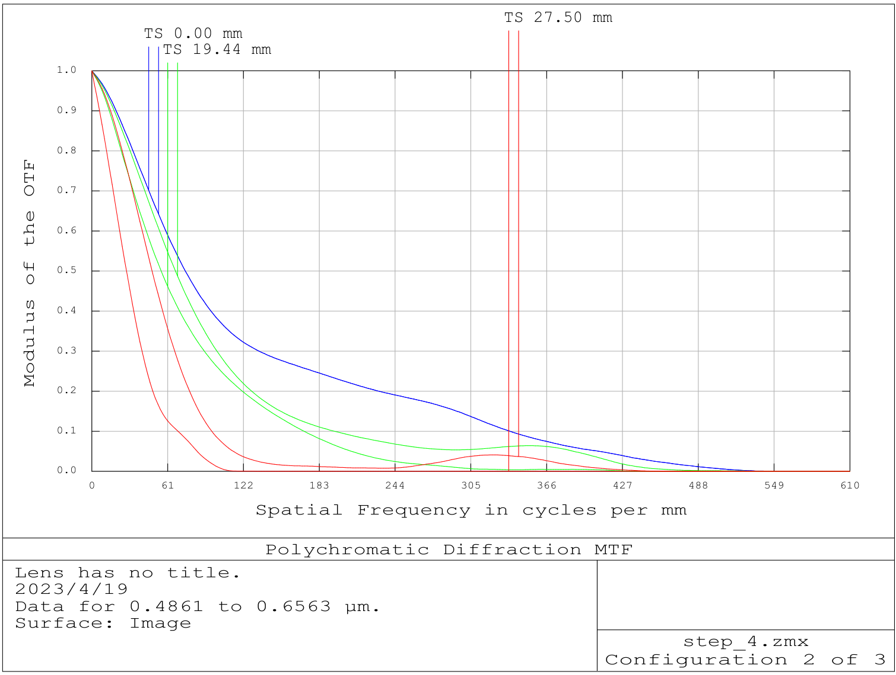
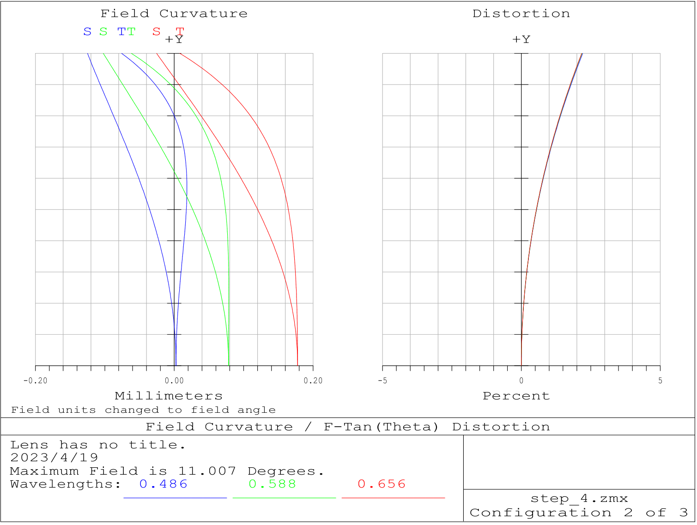

# A Simple Lens Design For Full Frame Cameras

This is a simple optical design project based on ZEMAX 2013, it is a objective lens for full frame cameras to be specific.

In this repo the zemax design files of initial structure, optimized structure and the final structure are provided.

## System Analysis

### Layout

Overall Layout

Objective Lens Layout

### Ray-Fan Plot

### MTF

### Field Curvature

### Grid Distortion

### Spot Diagram

### Image Simulation

As one can tell from the simulation, the chromatic aberration makes the imaging quality too poor for this design to be used. But compared to the original simulation, there is still some progress : ).

Image simulation on the original structure:

## General Lens Data

| key                              | value                                                |
| -------------------------------- | ---------------------------------------------------- |
| Surfaces                         | 21                                                   |
| Stop                             | 11                                                   |
| System Aperture                  | Float By Stop Size = 12.15                           |
| Glass Catalogs                   | SCHOTT                                               |
| Ray Aiming                       | Off                                                  |
| Apodization                      | Uniform, factor = 0.00000E+000                       |
| Temperature (C)                  | 2.00000E+001                                         |
| Pressure (ATM)                   | 1.00000E+000                                         |
| Adjust Index Data To Environment | Off                                                  |
| Effective Focal Length           | 122.5113 (in air at system temperature and pressure) |
| Effective Focal Length           | 122.5113 (in image space)                            |
| Back Focal Length                | -8.708459                                            |
| Total Track                      | 169.4433                                             |
| Image Space F/#                  | 3.001041                                             |
| Paraxial Working F/#             | 3.392864                                             |
| Working F/#                      | 3.387634                                             |
| Image Space NA                   | 0.1457935                                            |
| Object Space NA                  | 0.01063633                                           |
| Stop Radius                      | 12.15                                                |
| Paraxial Image Height            | 27.5                                                 |
| Paraxial Magnification           | -0.0721793                                           |
| Entrance Pupil Diameter          | 40.82293                                             |
| Entrance Pupil Position          | 73.92392                                             |
| Exit Pupil Diameter              | 22.56834                                             |
| Exit Pupil Position              | -76.49299                                            |
| Field Type                       | Real Image height in Millimeters                     |
| Maximum Radial Field             | 27.5                                                 |
| Primary Wavelength               | 0.5875618 µm                                         |
| Lens Units                       | Millimeters                                          |
| Angular Magnification            | 1.808859                                             |

Fields : 3

Field Type : Real Image height in Millimeters

| \#  | X-Value  | Y-Value   | Weight   |
| --- | -------- | --------- | -------- |
| 1   | 0.000000 | 0.000000  | 1.000000 |
| 2   | 0.000000 | 19.442500 | 1.000000 |
| 3   | 0.000000 | 27.500000 | 1.000000 |

Wavelengths : 3

Units: µm

| \#  | Value    | Weight   |
| --- | -------- | -------- |
| 1   | 0.486133 | 1.000000 |
| 2   | 0.587562 | 1.000000 |
| 3   | 0.656273 | 1.000000 |

## License

GPL
